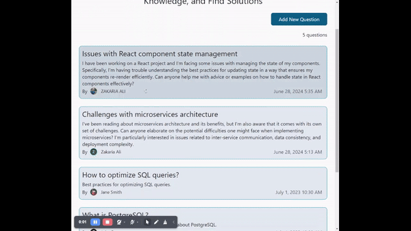
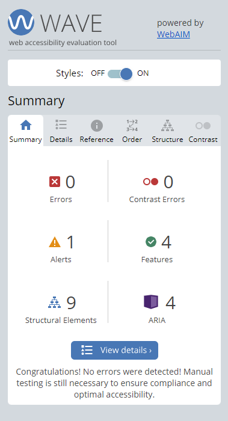
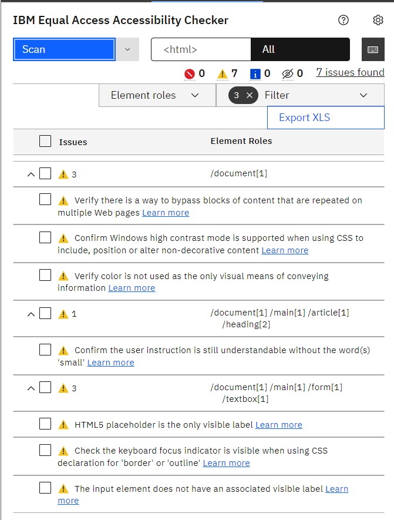
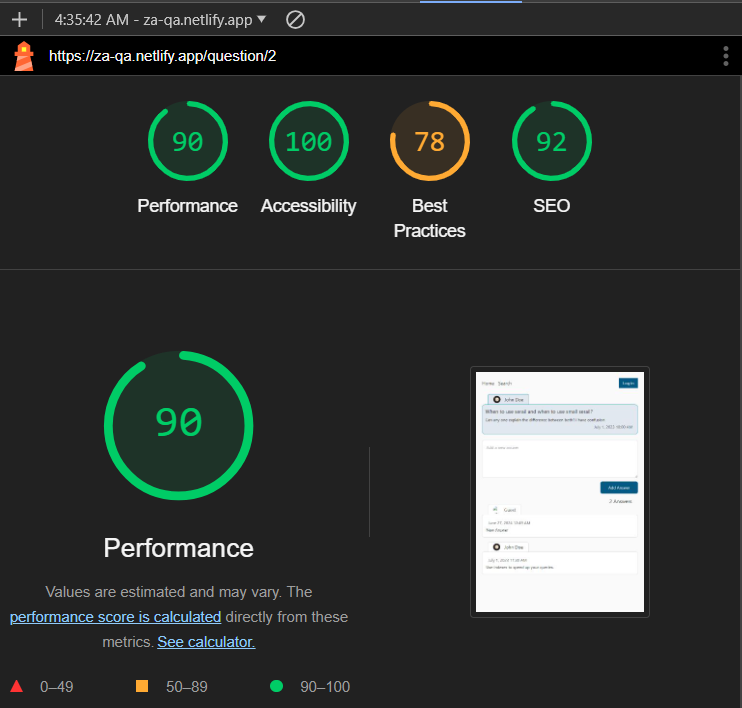
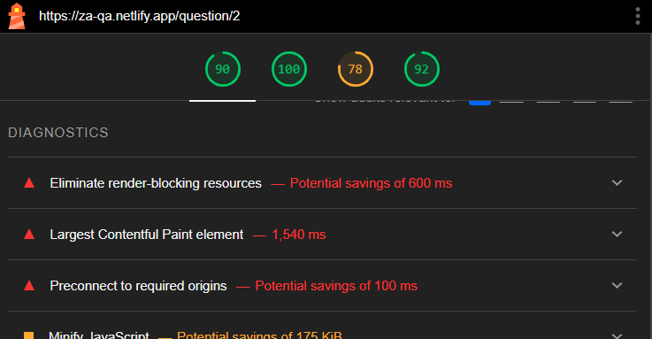

# Question & Answers - React

This is a Questions & Answers web full-stack application where users can create questions add, edit or delete their answers

## Overview

<p align="center">

</p>

## Technologies

The technologies used in this project are:

- HTML & Tailwind & TypeScript
- React
- Auth0
- Vite & Vitest

## Features

- **Responsive Design**: Ensures the App looks great on all devices.
- **Accessibility**: Built with accessibility in mind.
- **Innovative Solution**: Created innovative solution to complex challenge, demonstrating creativity and problem-solving skills.

## Setup

To run this app in development mode open the terminal and write the following:

```shell
git clone https://github.com/Zakaria9375/Q-A-react

cd Q-A-react

npm install

npm run dev
```

## Links

- [Backend Repository](https://github.com/Zakaria9375/QA-springboot-backend)
- [Live Demo](https://za-qa.netlify.app/)

## Testing

### Accessibility

This app has been crafted with a focus on accessibility, utilizing the Accessibility Linter, IBM Equal Access Accessibility Checker extension, and WCAG extension to adhere to accessibility best practices. Key features include: Zooming,
Keyboard-only navigation, Static code analysis, Aria rules compliance, and Semantic HTML.

### Unit Testing

To run and execute all the unit tests defined in the project after setting the app in development mode, open a new terminal and write the following:

```shell
npm run test
```

## Screenshots

<details>
  <summary><b>Some of Accessibility Tests Screenshots</b></summary>

<p align="center">

</p>

<p align="center">

</p>
</details>

<details>
  <summary><b>Lighthouse Report</b></summary>

<p align="center">

</p>
</details>

<details>
  <summary><b>Unit Tests Screenshots</b></summary>

<p align="center">

</p>
</details>

## Retrospectives

> What went well ?

I am proud of accessibility, styling, clean markup, innovative problem-solving, and attention to every detail.

> What could be improved ?

1. The score, that is calculated by light-house report.
2. The focus on `NavLink`, that does not appear by keyboard navigation.
3. Unit testing.
4. Proper of full integration of Auth0 into the app.

<p align="center">

</p>

## About the Author

> In every project I develop, I focus on improving code quality and incorporating new techniques into my development process. I strive to learn from my mistakes by addressing them directly and applying those lessons to future projects. My goal is to continuously refine and enhance **_my standard approach to project development_**.

- Portfolio - [Zakaria Ali](https://zaportfolio.netlify.app/)
- Frontend Mentor Profile - [@Zakaria9375](https://www.frontendmentor.io/profile/Zakaria9375)
- Project by - [Frontend Mentor team](https://www.frontendmentor.io/)

## Contributing

**Want to contribute?** _Great!_ Here’s how you can help:

1. Fork the repo and create your branch from `main`.
2. Make your changes and test.
3. Issue that "pull" request!

## License

MIT License  
Copyright (c) 2024-present, Zakaria Ali
